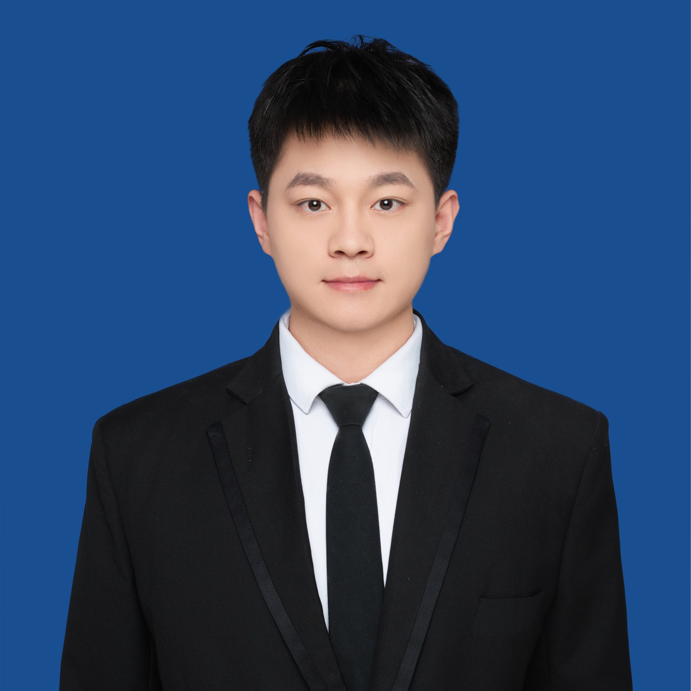



## Meet the Team

I am working as one of PIs in the building Bio-Robot Lab (BRL). Here is a list of my team members and their profiles.

<!--  -->

<!-- ## Current Members -->
### Post-doctoral Researcher
- **Zhikang Ge** (Post-doc, Fall 2024)

    Zhikang Ge earned a Ph.D. in Engineering from the Shenyang Institute of Automation, Chinese Academy of Sciences, in 2024. His research interests include robust sliding mode control, field robot's dynamics and control, adaptive control for nonlinear systems. Now he is committed to developing advanced robotic systems for the agricultural field, aiming to automate complex tasks and reduce the need for human labor. In the lab, he is mainly working on <a href="https://caseypen.github.io/portfolio/portfolio-G-rov-track/">the robust control of underwater robots</a>.

<!-- 

  
Publications

  <ul>
    <li>
        Robust adaptive sliding mode control for path tracking of unmanned agricultural vehicles. Zhikang Ge, Zhihong Man, Zhuo Wang, et al. Computers and electrical engineering, 108: 108693, 2023.
    </li>
  </ul>

 -->

### PI Engineer
- **Wenwu Lu** (Engineer, Fall 2024)

<!-- 

    Zhikang Ge earned a Ph.D. in Engineering from the Shenyang Institute of Automation, Chinese Academy of Sciences, in 2024. His research interests include robust sliding mode control, vehicle dynamics and control, robotics, adaptive control, and nonlinear systems. He is committed to developing advanced robotic systems for the agricultural field, aiming to automate complex tasks and reduce the need for human labor. Now, he focused on <a href="https://caseypen.github.io/portfolio/portfolio-G-rov-track/">the robust control of underwater robots</a>.

 -->

### PhD Students
- **Fang Yang** (Co-Advised, PhD, 09 2024)

<!-- - [Yorai Shaoul](https://personal/webpage/) (RI PhD, Fall 2022) -->

<!-- 

    Bio of the person

 -->
<!-- 

  
Publications

  <ul>
    <li>
        <a paper link">paper title</a>.         
        Paper affliation.
    </li>
  </ul>

  -->

### Masters Students

- **Yuting Yang** (Co-Advised, Master from ZJU, 09 2023)

### Internship students

- **Kangyue Shi** (Master of NSU, 05 2024)