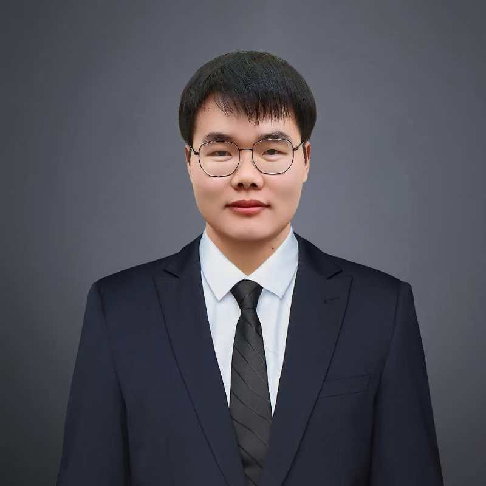



## Meet the Team

I am working as one of PIs in the Bio-Robot Lab (BRL) under construction. Here is a list of my team members and their profiles.

<!--  -->

<!-- ## Current Members -->
### Post-doctoral Researcher
- **Zhikang Ge** (Post-doc, Fall 2024)

    Zhikang Ge earned a Ph.D. in Engineering from the Shenyang Institute of Automation, Chinese Academy of Sciences, in 2024. His research interests include robust sliding mode control, field robot's dynamics and control, adaptive control for nonlinear systems. Now he is committed to developing advanced robotic systems for the agricultural field, aiming to automate complex tasks and reduce the need for human labor. In the lab, he is mainly working on <a href="https://caseypen.github.io/portfolio/portfolio-G-rov-track/">the robust control of underwater robots</a>.

<!-- 

  
Publications

  <ul>
    <li>
        Robust adaptive sliding mode control for path tracking of unmanned agricultural vehicles. Zhikang Ge, Zhihong Man, Zhuo Wang, et al. Computers and electrical engineering, 108: 108693, 2023.
    </li>
  </ul>

 -->
  

### PI Engineer
- **Wenwu Lu** (Engineer, Fall 2024)

  Wenwu Lu received his Master’s degree in Mechanical Engineering from Zhejiang Sci-Tech University in 2024. His technical background spans the design, modeling and control of agricultural robotic picking arms, as well as autonomous navigation for agricultural robots. He is enthusiastic in leveraging advanced mechanical design and intelligent control algorithms to enhance agricultural operation efficiency and reduce reliance on manual labor.

  <!-- Currently, Wenwu Lu is dedicated to developing intelligent robotic systems for precision agriculture, with a particular focus on fruit and vegetable harvesting. In the lab, his primary research involves the development of a transportation system for strawberry-picking robots. He is working on multi-robot cooperative control technology to address challenges in transportation and scheduling during harvesting, aiming to optimize operational efficiency. His research not only explores real-time collaboration and communication in multi-robot systems but also includes high-precision motion control and navigation optimization in complex agricultural environments, driving the evolution of agricultural robots from single-task execution to multi-task coordination. -->

 

  

### PhD Students
- **Fang Yang** (Co-Advised, PhD from ZJU, 09 2024)

    Currently, she is pursuing her doctoral degree at Zhejiang University, with a focus on the advanced field of underwater robotics. Her academic journey has included research on cooperative control and task allocation for multi-unmanned underwater vehicle (MUUV) systems, as well as advancements in acoustic detection. Her current research is centered on the critical area of underwater vehicle localization, specifically for remotely operated vehicles (ROVs) used in mariculture environments. In the lab, her work is mainly working on the localization of ROV in aquaculture settings.

  

### Masters Students

- **Yuting Yang** (Co-Advised, Master from ZJU, 09 2023)

  Yang Yuting is a Master’s student at Zhejiang University, having earned her Bachelor’s degree in Agricultural Engineering from Nanjing Agricultural University in 2023. Her research is focused on developing innovative solutions for anomaly detection in small sample sizes using generative models such as GANs and Stable Diffusion. Yang is particularly passionate about applying these techniques to enhance the perception modules of Autonomous ROVs for net inspection in net cage fishing. 

  

### Internship students

- **Kangyue Shi** (Master of NTU, 05 2024)
